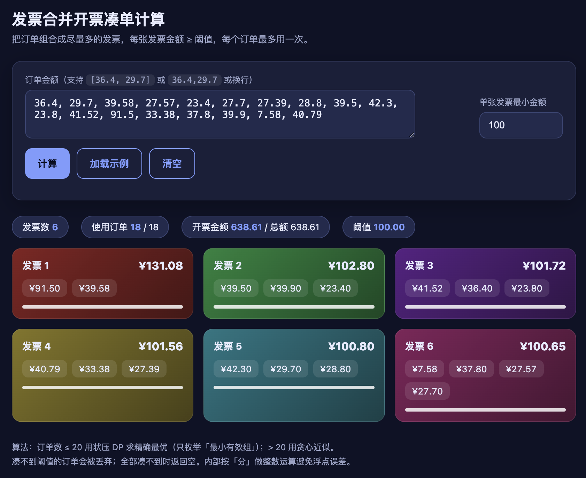
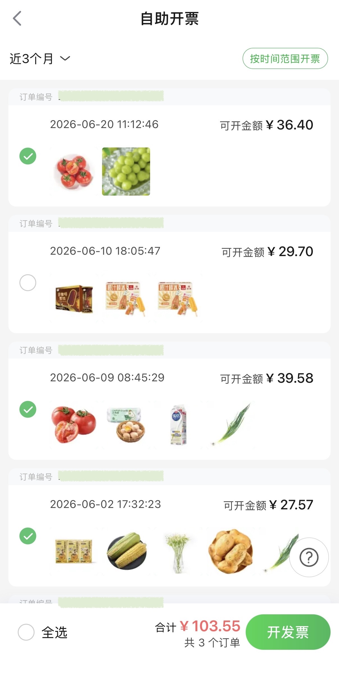

# 发票有奖合并开票凑单脚本

> [](https://github.com/BreadKid/invoice-merge-solver/blob/main/LICENSE)


国内的伙伴们，有奖发票抽了好多次了，最近发现有些平台可以小额订单合并开票，写了个凑单的计算工具。

## 用法
### 可视化
[](https://breadkid.github.io/invoice-merge-solver/)
### 命令行

```bash
# 方括号列表 + 阈值
python3 scripts.py "[36.40, 29.70, 39.58, ..., 40.79]" 100

# 逗号分隔 + 阈值
python3 scripts.py "40,40,60,60" 100

# 无参数 -> 运行内置示例
python3 scripts.py
```

- 第 1 个参数：订单金额数组，支持 `[...]` 列表或 `40,40,60,60` 逗号分隔
- 第 2 个参数：单张发票最小金额阈值（缺省取 100）

### 作为库调用

```python
from scripts import calculate
calculate([36.40, 29.70, 39.58, 27.57], threshold=100)
```

## 示例输出

```text
发票 1: [91.5, 39.58]  共 131.08 元
发票 2: [39.5, 39.9, 23.4]  共 102.80 元
发票 3: [41.52, 36.4, 23.8]  共 101.72 元
发票 4: [40.79, 33.38, 27.39]  共 101.56 元
发票 5: [42.3, 29.7, 28.8]  共 100.80 元
发票 6: [7.58, 37.8, 27.57, 27.7]  共 100.65 元
共 6 张发票，使用订单 18 / 18 单
```

输入 18 单、阈值 100，输出 6 张发票（理论最优 `floor(638.61 / 100) = 6`）。

## 业务场景

有一批订单需要开发票，可以单独开票也可以合并开票。要求每张发票上的金额必须 `>= 阈值`（默认 100 元，可参与抽奖等活动的最小金额）。在满足该约束的前提下，希望**开出尽量多的发票**，需要决定如何组合订单。

## 问题定义

给定一组价格数组，将其分成**最多的组合**，使得：

- 每个组合的和 `>= 阈值`
- 每个组合内元素数 `>= 1`
- 每个价格最多使用一次

## 算法说明

订单数 `<= 20` 时给出**精确最优解**，`> 20` 时给出贪心近似解。

- **大订单单独成票**：单个订单 `>= 阈值` 时单独开一张（必然最优，合并只会占用其他订单而不会增加发票数）。
- **状压 DP 求最大不相交分组数**：对其余订单（均 `< 阈值`）用位掩码 DP 求最多不相交分组。
  - 只枚举「**最小有效组**」——金额 `>= 阈值` 且去掉任一元素后即不足阈值的组（等价 `sum >= k 且 sum - min < k`）。任何最优解都可改写为只用最小有效组：若某组内含一个已达阈值的真子组，可用该子组替换它，多余订单转为剩余，发票数不变。
  - 仅枚举最小组使候选数量大幅下降（样本 18 单：19286 → 844），DP 从约 21s 降到 0.5s。
- **整数运算**：内部按「分」做整数计算，避免浮点累加误差。
- **回退贪心**：订单数 `> 20` 或候选组过多时，回退到「大订单做锚点 + 最小订单凑足」的贪心近似解（不保证最优）。

## 输出语义

- 凑不到阈值的剩余订单会被**丢弃**，不输出。
- 若全部订单都无法凑到阈值，返回**空列表**。

## 适用规模与性能

| 订单数 | 算法 | 性能 |
|--------|------|------|
| `<= 20` | 状压 DP（精确最优） | 秒级（18 单约 0.5s，20 单约 1s） |
| `> 20`  | 贪心近似 | 极快 |

## 环境依赖

- Python 3.14+（代码本身兼容 3.6+）
- 纯标准库，无需安装任何第三方依赖

目前发现的合并开票购物平台：
- 叮咚买菜 

## License

[AGPL-3.0 license](https://github.com/BreadKid/invoice-merge-solver/blob/main/LICENSE)
